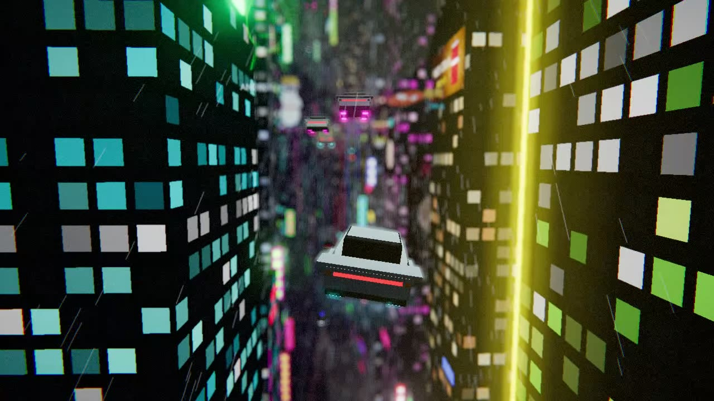
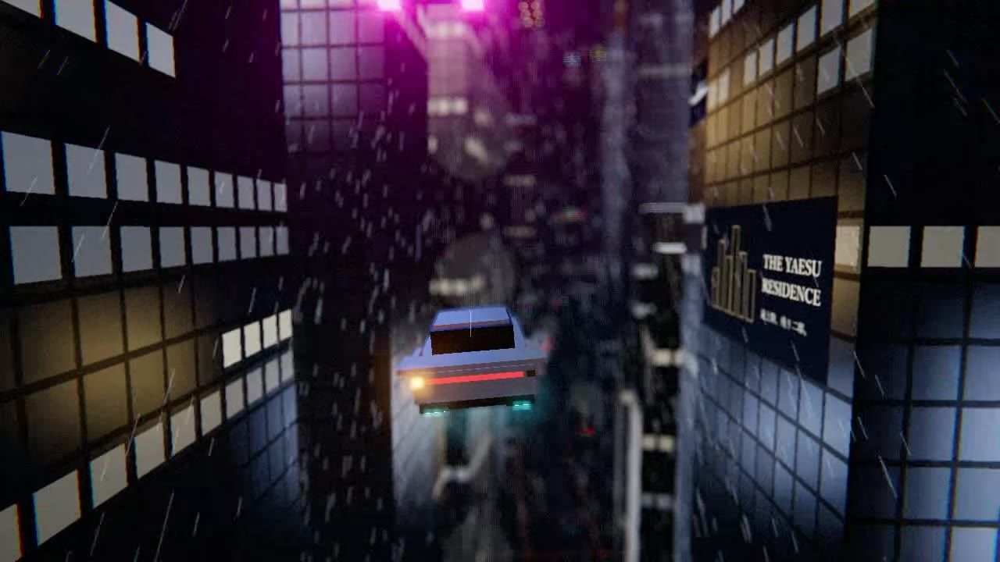
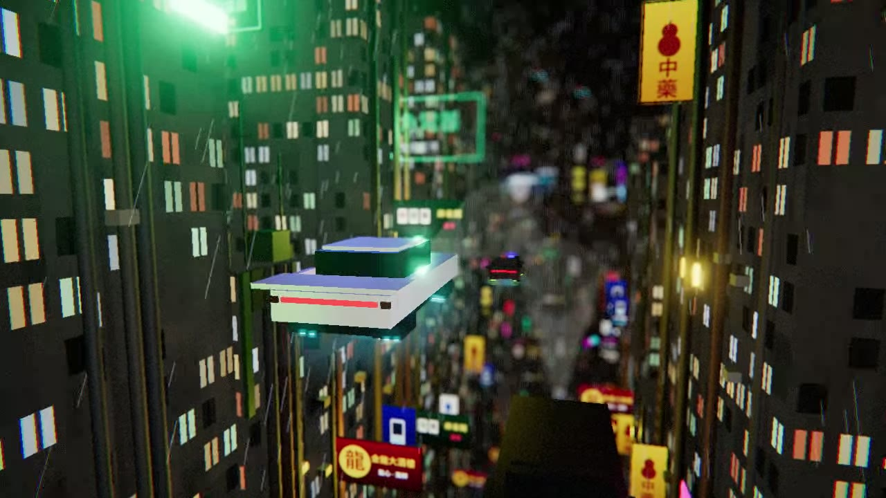
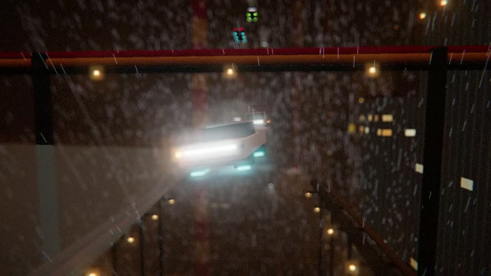

# ネオンレイン・スカイウェイ



**▶ ブラウザで見る: https://kasei-san.com/neon-rain-skyway/**
**▶ デモ（4エリアを順に回る）: https://kasei-san.com/neon-rain-skyway/?demo**

雨のサイバー都市の空中航路を、エアカーで延々と飛ぶ Three.js 作品です。
ボクセルのビル群、絵と文字の入った看板広告、上下を行き交う空の交通を、被写界深度のボケと発光で描きます。
音楽・雨音・効果音もすべてブラウザ内で合成しています（作品本体は画像や音声のファイルを使っていません）。

| シンジュク | 八重洲 | クーロン | 工業地帯 |
|---|---|---|---|
|  |  |  |  |

## エリア

| エリア | 街並み | 空の交通 |
|---|---|---|
| シンジュク | ネオンと広告だらけの高層ビルの谷 | いろいろな機体 |
| 八重洲 | 金や銀の鏡面タワーと、上品な社名サインや高級品の看板 | 黒と白のセダンが中心 |
| クーロン | 汚れた壁、配管、室外機、洗濯物、植物、中国語の看板がぎっしり | いろいろな機体 |
| 工業地帯 | 紅白の煙突と煙、ガスタンク、蒸留塔、航路をまたぐ配管橋、低く垂れこめた霧 | トラックとタンクローリーが多め |

## 見どころ

- **航路** — ゆるく左右に曲がり、ときどき交差点を直角に曲がって別の道路に入る
- **自機** — ウインカーを出して車線変更し、ときどき大きく上下に移動する
- **ほかの機体**
  - 同じ高さの機体と抜きつ抜かれつする
  - 上下ばらばらの高さを、同じ向きと対向の機体が飛ぶ
  - 別の空中道路の流れが、上下で直角に横切る
  - 交差点では、半分くらいの機体が曲がらずに直進していく
- **機体の種類** — セダン、スピナー風のパトカー、貨物機、空中バス、タンクローリー
- **天気** — 雨の筋、濃い霧、地面近くの低い霧
- **広告** — 招き猫、アイドル、錦鯉銀行、牙醫、麻雀館、危険表示など約30種類。ブランドはすべて架空。ときどきちらつく
- **サウンド**
  - 短調のシンセパッドとブラスの BGM
  - 雨音、エアカーが通り過ぎる音、ウインカー、上昇・下降のうなり

## 操作

| 操作 | 内容 |
|---|---|
| クリック | 音を鳴らす（ブラウザの自動再生制限のため） |
| 左下のエリア名 | 次の移動先を選ぶ。「今すぐ」でその場で移動 |
| 左下の 📷 | カメラのアングルを選ぶ（「自動で切り替え」で戻る） |
| `1`〜`4` | エリアへすぐ移動（シンジュク・八重洲・クーロン・工業地帯） |
| `C` | 次のカメラアングルへ |
| `G` | 設定パネル（ボケ・発光・霧・雨・交通量・音量など） |
| `M` | ミュート |

## URL パラメータ

| パラメータ | 内容 |
|---|---|
| `?demo` | 4エリアを1エリア750mずつ順に回る（約30秒。前の機体に詰まったり交差点で減速すると延びる）。クリックで開始 |
| `?pv` | 約1分の PV |
| `?area=kowloon` | 始まりのエリアを指定（`shinjuku` / `yaesu` / `kowloon` / `industrial`） |
| `?demo&rec` / `?pv&rec` | 1280×720 で録画する。ローカルの保存用サーバーが必要（下記）。`?rec` だけなら PV を録画する |
| `?pv&demo` | デモが優先される |
| `?pv&snap=5,12` | 指定した秒の画面を PNG で保存する（確認用。保存用サーバーが必要） |

## ローカルで動かす

`index.html` 1ファイルだけで動きます。Three.js は CDN から読み込むので、ネット接続が必要です。

```sh
python tools/rec_server.py 8767
# http://localhost:8767/ を開く
```

## デモを動画にする

```sh
# 1. 保存用サーバー（動画を受け取ると終了する）
python tools/rec_server.py 8767

# 2. 録画用の Chrome を別プロファイルで起動する
#    ウィンドウが他のウィンドウに隠れても描画が止まらないように、フラグを付ける
chrome --user-data-dir=tmp_chrome_profile --no-first-run \
  --autoplay-policy=no-user-gesture-required \
  --disable-backgrounding-occluded-windows --disable-renderer-backgrounding \
  --disable-background-timer-throttling \
  --app="http://localhost:8767/index.html?demo&rec"
```

- 4エリアを1周すると、`out/demo_raw.webm` と、エリアが切り替わった時刻の `out/demo_areas.json` が保存されます
- 画面に重ねたエリア名は録画に写らないので、スマホ向けの mp4 に変換するときに、この時刻を使って ffmpeg の `drawtext` で焼き込みます

## 技術メモ

- Three.js r160（CDN）、ビルド不要の単一 HTML
- 航路は 1m 刻みの中心線を生成し、50m ごとのチャンク単位で建物を組み立てて捨てる。同じマテリアルの形はチャンクごとに結合する
- 交差点では、元の道路の続きと交差する道路の反対側の街を「仮のまっすぐな道路」として作り、ほかの区間の航路やビルと重ならないものだけを置く
- ポストプロセスは RenderPass → BokehPass → UnrealBloomPass → レンズ（周辺減光・色収差・フィルムグレイン）→ OutputPass
- 光のにじみ・雨・低い霧は別レイヤーに置き、被写界深度の深度バッファには入れない
